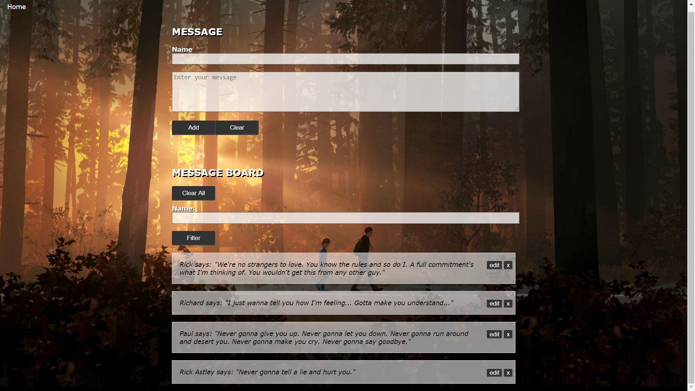

# Message Log Website 2.0
### *Tech Stack: React, Redux, JSX, CSS, Express, MongoDB*
- Add: Logs the message entered into the text area in the message board
- Clear: Clears the message in the text area
- Clear All: Removes all items on message board
- Delete Message: Clicking the x within the message will remove the message from the board
- Name: If name is entered, will produce message saying: Name says: "Text"; if empty, will show as Anonymous.
- Message: If a message is clicked, a side bar will appear with message details
- Edit: Clicking edit button will create a message box to edit the message.
Click save to update the message and message date. To go back without any changes, click edit again.
- UPDATE June 18, 2019: Messages are now connected to the server.

### How to run the project:
Run `npm start` from the terminal.

### *Main Page*

### *Main Page (Edit)*

### *Main Page (Side Panel)*

### References and Resources:
How to add Express backend to a React app
https://www.freecodecamp.org/news/create-a-react-frontend-a-node-express-backend-and-connect-them-together-c5798926047c/

Creating Actions for Fetching Posts
https://redux.js.org/advanced/async-actions#async-action-creators
https://daveceddia.com/where-fetch-data-redux/

How to Reuse MongoDB Connection:
https://stackoverflow.com/questions/24621940/how-to-properly-reuse-connection-to-mongodb-across-nodejs-application-and-module
---

This project was bootstrapped with [Create React App](https://github.com/facebook/create-react-app).

## Available Scripts

In the project directory, you can run:

### `npm start`

Runs the app in the development mode. 
Open [http://localhost:3000](http://localhost:3000) to view it in the browser.

The page will reload if you make edits. 
You will also see any lint errors in the console.

### `npm test`

Launches the test runner in the interactive watch mode. 
See the section about [running tests](https://facebook.github.io/create-react-app/docs/running-tests) for more information.

### `npm run build`

Builds the app for production to the `build` folder. 
It correctly bundles React in production mode and optimizes the build for the best performance.

The build is minified and the filenames include the hashes. 
Your app is ready to be deployed!

See the section about [deployment](https://facebook.github.io/create-react-app/docs/deployment) for more information.

### `npm run eject`

**Note: this is a one-way operation. Once you `eject`, you can’t go back!**

If you aren’t satisfied with the build tool and configuration choices, you can `eject` at any time. This command will remove the single build dependency from your project.

Instead, it will copy all the configuration files and the transitive dependencies (Webpack, Babel, ESLint, etc) right into your project so you have full control over them. All of the commands except `eject` will still work, but they will point to the copied scripts so you can tweak them. At this point you’re on your own.

You don’t have to ever use `eject`. The curated feature set is suitable for small and middle deployments, and you shouldn’t feel obligated to use this feature. However we understand that this tool wouldn’t be useful if you couldn’t customize it when you are ready for it.

## Learn More

You can learn more in the [Create React App documentation](https://facebook.github.io/create-react-app/docs/getting-started).

To learn React, check out the [React documentation](https://reactjs.org/).

### Code Splitting

This section has moved here: https://facebook.github.io/create-react-app/docs/code-splitting

### Analyzing the Bundle Size

This section has moved here: https://facebook.github.io/create-react-app/docs/analyzing-the-bundle-size

### Making a Progressive Web App

This section has moved here: https://facebook.github.io/create-react-app/docs/making-a-progressive-web-app

### Advanced Configuration

This section has moved here: https://facebook.github.io/create-react-app/docs/advanced-configuration

### Deployment

This section has moved here: https://facebook.github.io/create-react-app/docs/deployment

### `npm run build` fails to minify

This section has moved here: https://facebook.github.io/create-react-app/docs/troubleshooting#npm-run-build-fails-to-minify
